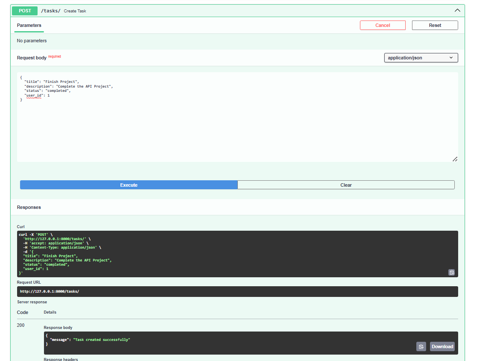
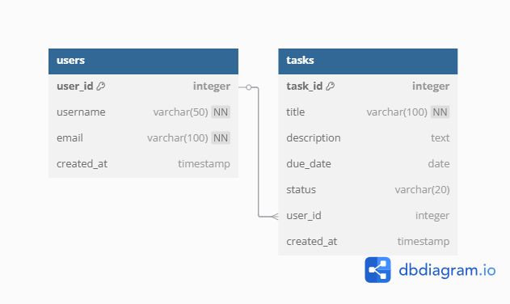

# Task Manager API

## Project Description
A RESTful CRUD API built with FastAPI and MySQL for managing tasks and users.

## Features
- Create, read, update, and delete users
- Create, read, update, and delete tasks
- MySQL database backend


## Setup Instructions

### Prerequisites
- Python 3.8+
- MySQL Server
- Git

### Installation
1. Clone the repository:
   ```bash
   git clone https://github.com/oluwoleowoeye/task-manager-api.git
   cd task-manager-api

2.  Set up virtual environment:
  python -m venv venv
  source venv/bin/activate  # Linux/Mac
  venv\Scripts\activate     # Windows

3. Install dependencies:
  pip install -r requirements.txt

4. Set up MySQL database:
  mysql -u root -p < database.sql

5. Configure environment variables
  
Running the Application:
uvicorn main:app --reload

API Documentation
Access the interactive docs at: http://localhost:8000/docs

## Screenshots

### 1. API Documentation


### 2. Running Server


## Database Structure

### ER Diagram


**Tables Shown:**
1. `users` - Stores user account information
   - Primary Key: `user_id`
   - Unique fields: `username`, `email`

2. `tasks` - Contains all task items
   - Primary Key: `task_id`
   - Foreign Key: `user_id` (links to users table)
   - Status can be: pending, in_progress, or completed

**Relationships:**
- One user can have many tasks (1-to-many relationship)
